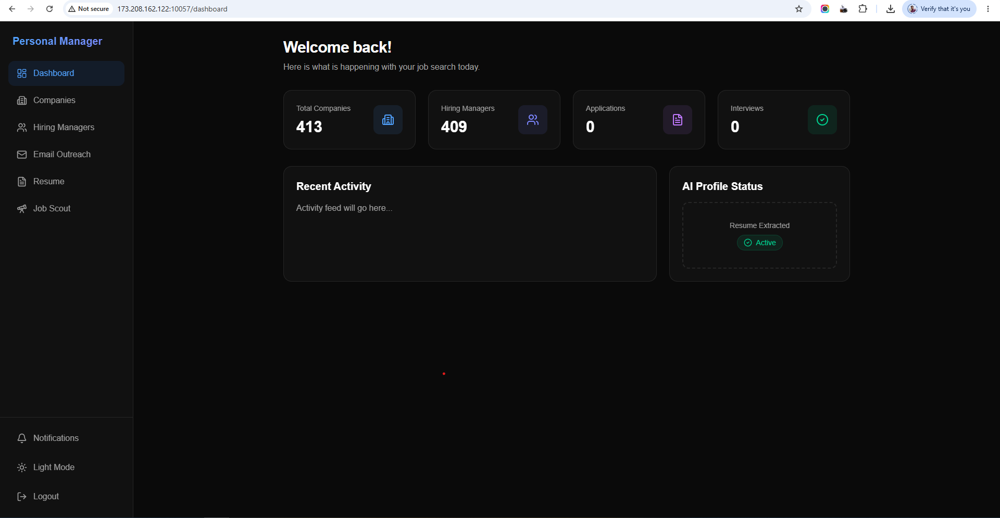
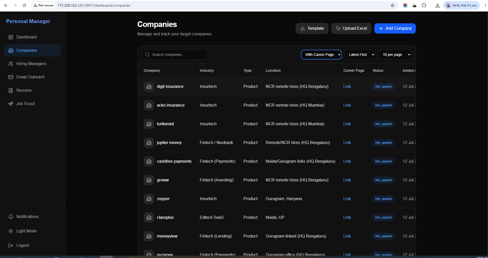
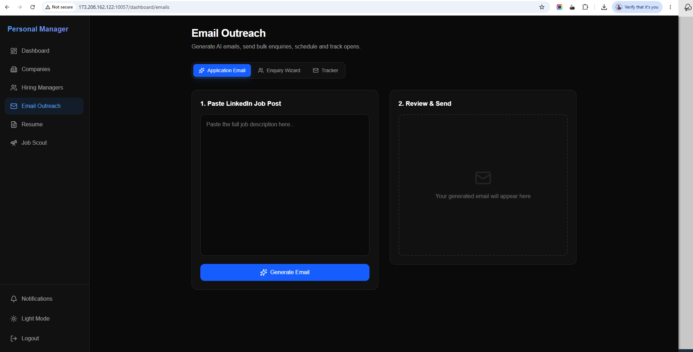
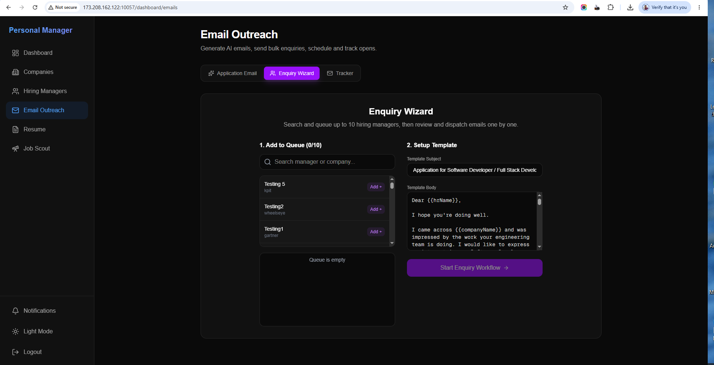

# Personal Management Tool

**Live Demo**: [http://173.208.162.122:10057/login](http://173.208.162.122:10057/login)

A comprehensive full-stack application designed to manage personal tasks, job applications, hiring manager contacts, and automated email outreach. The system is built with a modern tech stack featuring a React-based frontend and a robust Node.js backend.

## 🚀 Features

- **Automated Email Outreach**: Schedule and send customized job application emails to hiring managers using `nodemailer` and `node-cron`.
- **AI-Powered Email Generation**: Leverage AI (Gemini and Groq) to automatically generate tailored emails based on job descriptions or LinkedIn posts and your resume.
- **Resume Management**: Upload, parse, and extract information from your resumes automatically using AI.
- **Contact Management**: Keep track of companies and hiring managers.
- **Tracking & Analytics**: Track whether your sent emails have been opened and if any links have been clicked.
- **Job Scout**: Automatically scout for jobs and manage them effectively (integrated with Playwright for automation).

## 📸 Screenshots

| Job Scout View 1 | Job Scout View 2 |
| :---: | :---: |
|  |  |
|  |  |

## 🛠️ Technology Stack

### Frontend
- **Framework**: Next.js 16
- **Styling**: TailwindCSS v4
- **Icons**: Lucide React
- **HTTP Client**: Axios
- **State Management / UI**: React, React Hot Toast, next-themes for Dark Mode

### Backend
- **Framework**: Node.js & Express.js
- **Database**: MongoDB (Mongoose)
- **Authentication**: JWT (JSON Web Tokens), bcrypt for password hashing
- **File Uploads**: Multer, Cloudinary
- **AI Integration**: `@google/generative-ai` (Gemini) and `groq-sdk`
- **Automation & Scheduling**: `node-cron`, `playwright`
- **Email Delivery**: Nodemailer
- **File Parsing**: `pdf-parse`, `xlsx`

## 📁 Project Structure

- `/frontend`: Next.js web application.
- `/backend`: Express.js REST API server.
- `docker-compose.yml`: For containerized deployment.

## ⚙️ Getting Started

### Prerequisites
- Node.js (v18+)
- MongoDB instance
- Docker & Docker Compose (optional for containerized setup)

### Installation

1. **Clone the repository**
   ```bash
   git clone <repository-url>
   cd personal-management-tool
   ```

2. **Backend Setup**
   ```bash
   cd backend
   npm install
   ```
   Create a `.env` file in the `backend` directory with your database connection, AI API keys, and JWT secrets.
   ```bash
   npm run dev
   ```

3. **Frontend Setup**
   ```bash
   cd frontend
   npm install
   ```
   Create a `.env.local` file in the `frontend` directory if necessary (e.g., API URL).
   ```bash
   npm run dev
   ```

## 🐳 Docker Setup
To run the entire stack using Docker Compose:
```bash
docker-compose up -d --build
```

## 📄 License
ISC License
